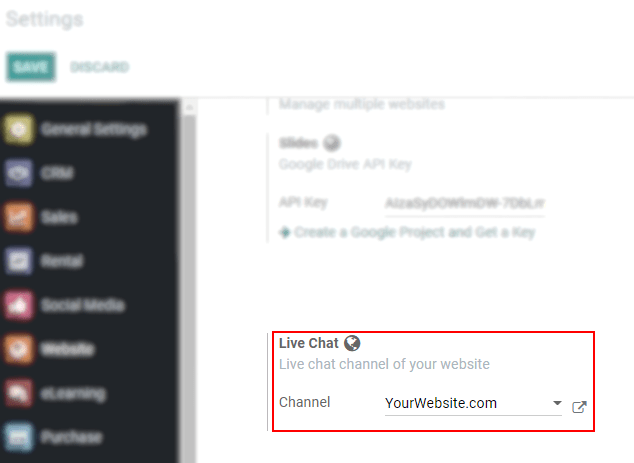
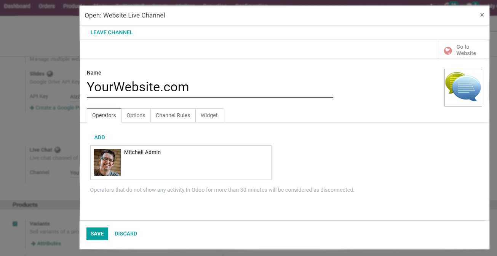
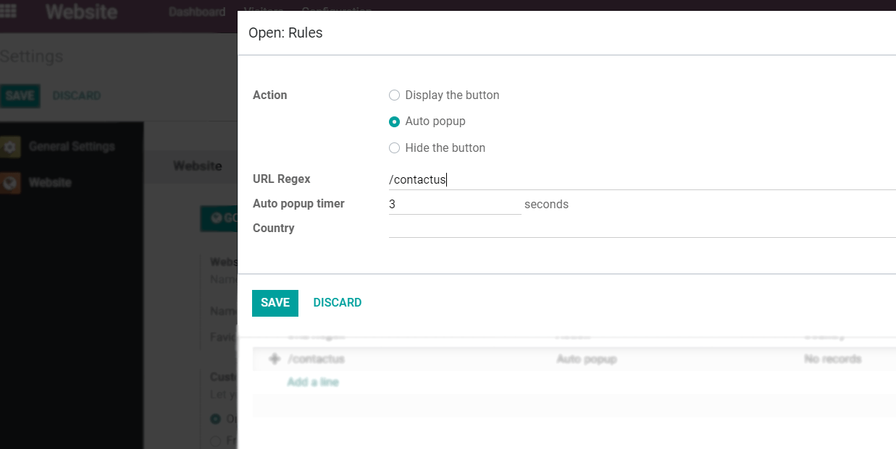
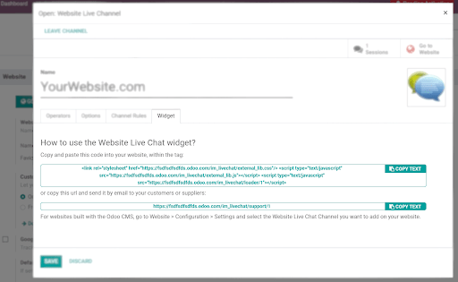
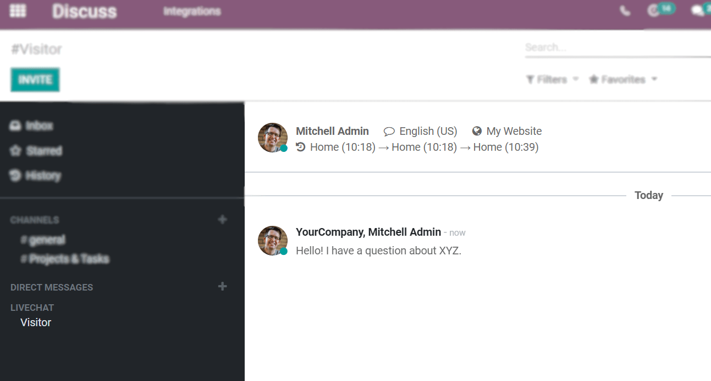
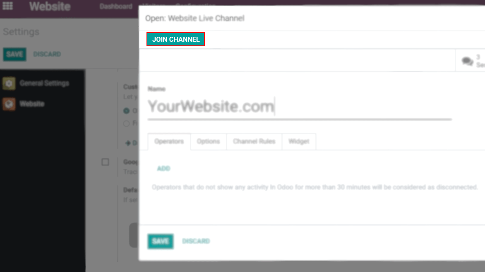

==========================
Get Started with Live Chat
==========================

Real-time chat is a cost-effective tool and a great way to bring visitors back to your website. It
is an accessible and convenient customer support channel, and can increase efficiency, considering
that this way, support representatives can handle more than one case at a time.

Activate and set it up
======================

Once *Live Chat* is installed on your database, if your website was created with Odoo, the
application is automatically added to it. All that is left to do is to go to
:menuselection:`Website --> Configuration --> Settings --> Live Chat`.

Select the channel to be linked to your website or create one on the fly.

| For both scenarios, under:
| - **Operators**: add agents to respond to the chat requests. Add as many as you like, and keep in
  mind that operators that do not show any activity in Odoo for more than 30min are considered
  disconnected.
| - **Options**: set the default text to be shown on the live chat button; an automated welcome
  message to be seen by visitors when a conversation is initiated, and the text that prompts the
  user to initiate a chat.
| - **Channel Rules**: choose an action for a given URL, and/or per country. In the example below,
  the chat window pops-up automatically after 3 seconds of users, from any country, landing on the
  contact us page.

.. note::
   GeoIP, which refers to the process of finding a computer terminal’s geographical location by its
   IP address, must be installed on your server. Otherwise, under *Channel Rules*, countries are
   not taken into account.

External options
----------------

| If your website was not created with Odoo, still in the channel form, under the *Widget* tab,
  copy and paste the code available to your website.
| Odoo also offers an URL you can send to users so they can have access to a single live chat page.

Managing chat requests
======================

Conversations initiated by visitors pop up as a direct message, and are shown in *Discuss*.
Therefore, inquiries can be answered wherever you are in Odoo.

.. note::
   Conversations are dispatched based on the current workload of the online operators.

Leave or join a channel
=======================

Go to :menuselection:`Website --> Configuration --> Settings`, access your channel under
*Live Chat*, and *Join Channel* or *Leave Channel*.

.. seealso::
   - :doc:`ratings`
   - :doc:`responses`